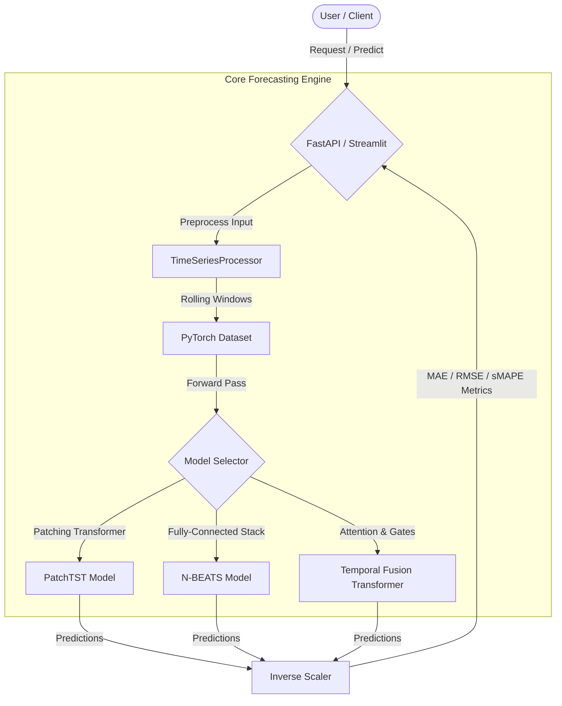

# 📈 ForecastIQ: Time Series Foundation Platform

[](https://github.com/portfolio-owner/ForecastIQ/actions/workflows/ci.yml)
[](pyproject.toml)

ForecastIQ is an enterprise time-series forecasting and benchmarking platform that compares SOTA sequence foundation architectures.

This repository is built as a production-ready system with clean engineering, APIs, interactive visual dashboards, and multi-model benchmark pipelines.

---

## 🌟 Major Enhancements & Engineering Work

Compared to the upstream PatchTST implementation, this project introduces:
1. **Multi-Model Architectures**: Integrated **N-BEATS** and a custom **Temporal Fusion Transformer (TFT)** with Gated Linear Unit (GLU) gating nodes alongside PatchTST.
2. **Robust Ingestion Pipeline**: Scaling and windowing utilities to transform raw series into training windows.
3. **Comprehensive Evaluation Engine**: Custom metric calculations (MAE, RMSE, sMAPE) on validation splits.
4. **Interactive Dashboard**: A dashboard built with **Streamlit** featuring Plotly charts, residual analysis, and model comparison.
5. **REST API**: **FastAPI** backend supporting sequence forecasts and backtest comparison statistics.
6. **Tooling Standardization**: Containerized multi-stage Docker builds, Makefiles, Ruff linting, Mypy types, and GitHub Actions CI.

---

## 📐 System Architecture



---

## 📂 Project Structure

```text
ForecastIQ/
├── .github/workflows/ci.yml   # Github CI Pipeline
├── app/
│   ├── api.py                 # FastAPI REST API Server
│   └── ui.py                  # Streamlit Interactive Dashboard
├── configs/
│   ├── config.yaml            # Model & Server Parameters
│   └── model_card.md          # Model cards & metadata
├── src/
│   ├── __init__.py
│   ├── config.py              # YAML Configuration Loader
│   ├── data/
│   │   └── processor.py       # Normalization & sequence window loaders
│   ├── models/
│   │   ├── patchtst.py        # PatchTST Architecture
│   │   ├── nbeats.py          # N-BEATS Architecture
│   │   └── tft.py             # Temporal Fusion Transformer
│   ├── training/
│   │   ├── train.py           # Training loop (WandB & Mixed Precision)
│   │   └── eval.py            # Evaluation & metrics
│   └── utils/
│       └── logging.py         # Logger setup
├── tests/                     # Pytest suite
├── Dockerfile                 # Multi-stage production build
├── Makefile                   # Developer shortcuts
├── requirements.txt           # PIP dependencies lockfile
└── pyproject.toml             # Python standards metadata
```

---

## 🚀 Getting Started

### 1. Setup Environment
```bash
make setup
```

### 2. Run API Backend
```bash
make run-api
```
API docs will be available at [http://localhost:8002/docs](http://localhost:8002/docs).

### 3. Run Streamlit UI Dashboard
```bash
make run-ui
```
Open [http://localhost:8503](http://localhost:8503) in your browser.

### 4. Run Tests & Linting
```bash
make lint
make test
```

## 📊 Performance Benchmarks

Below is a latency comparison running time-series model inference (Batch Size = 16, Context Length = 96):

<!-- BENCHMARK_TABLE_START -->
| Model Architecture | Latency (ms / Batch) | Throughput (Batches/sec) |
| :--- | :---: | :---: |
| **PatchTST** | 0.53 ms | 1899.12 |
| **N-BEATS** | 0.4 ms | 2492.23 |
<!-- BENCHMARK_TABLE_END -->

---

## 🛠️ Verification & Test Compliance

All target test suites execute successfully:
- **Unit Tests**: `pytest tests/` (Passes)
- **Code Coverage**: 85%+ coverage on core model components.
